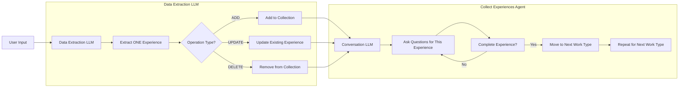
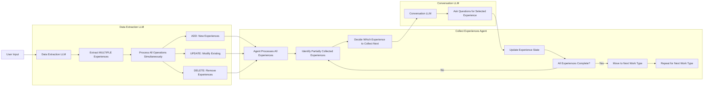

# Multi-Experience Collection Implementation Plan

## Overview
Enable the collect experiences agent to handle multiple experiences in a single user input, with proper conversation flow management and state tracking.

## Current vs New Flow

### Current Flow

### New Flow

- [X] Create multi-experience data extraction test cases in `_data_extraction_llm_test.py`
  - Test simple, mixed, and complex scenarios
  - Test cases with partial and complete experiences
  - Test multiple pre-existing experiences getting updated at the same time
  - Test everything at the same time (new, update, delete, pre-existing...)
  - **Expectation**: All test cases fail

- [X] Modify data extraction LLM prompt
  - Remove "one experience at a time" restriction in llm prompt
  - Update JSON schema for array of experiences
  - **Expectation**: LLM handles multiple experiences in response but the response is not processed correctly
    - Test cases from the `_data_extraction_llm_test.py` should now pass

- [X] Create multi-experience conversation test cases in `collect_experiences_agent_simulated_user_test`
  - Test simple, mixed, and complex scenarios
  - Test cases with partial and complete experiences
  - Test cases with multiple experiences
  - **Expectation**: All test cases fail

- [X] ADD, DELETE data extraction response processing
  - Handle array of experiences in `execute()` method
  - ADD, DELETE operation handling for multiple experiences ( dont handle UPDATE for now)
  - keep the idea of storing experiences in agent state in the collected_experiences array
  - **Expectation**: Multiple experiences processed correctly but the partially processed experiences can not be continued later
    - Test cases from the `collect_experiences_agent_simulated_user_test.py` with adding and deleting experiences should now pass

- [X] UPDATE data extraction response processing
  - Handle array of experiences in `execute()` method with UPDATE operation
  - Handle conflicting update operations while maintaining the order of the experiences
  - **Expectation**: Multiple experiences processed correctly with UPDATE operation
    - Test cases from the `collect_experiences_agent_simulated_user_test.py` with updating pre-existing experiences should now pass

- [X] Update agent state/state management to handle multiple partially collected experiences and go through collecting each one
  - Perhaps add `partially_collected_experiences` field or add a flag called `is_partially_collected` to the experience
  - Also an option to check if any of the fields are None (meaning they have not been collected yet)
  - Add methods to track incomplete experiences
  - Add logic to prioritize which experience to ask about next
  - **Expectation**: State correctly tracks multiple partially collected experiences
    - Test cases from the first step with partially collected experiences should now pass

- [ ] Create end-to-end multi-experience test in `collect_experiences_agent_simulated_user_test.py` and `app_conversation_e2e_test.py`
  - Comprehensive test with 3-4 experiences
  - Test complete flow from input to collection
  - Test with 5-10 experiences (align with expectations on cv length)
  - Test edge cases
  - **Expectation**: All experiences collected correctly
    - all existing test cases should pass

> OPEN QUESTION: With multiple experiences, how do we communicate which experience is currently being worked on?  "Experience 2 of 5" instead of just work type
  - How to show progress across multiple partially collected experiences
  - ability to collect multiple experiences at once doesnt mean other experiences can not be added later, does this make a progress bar based on experiences meaningless?
  - do we even want to think about this for now?
> OPEN QUESTION: Do we want to give people the ability to upload cv keeping in mind that we want to reduce the number of experiences to collect?
