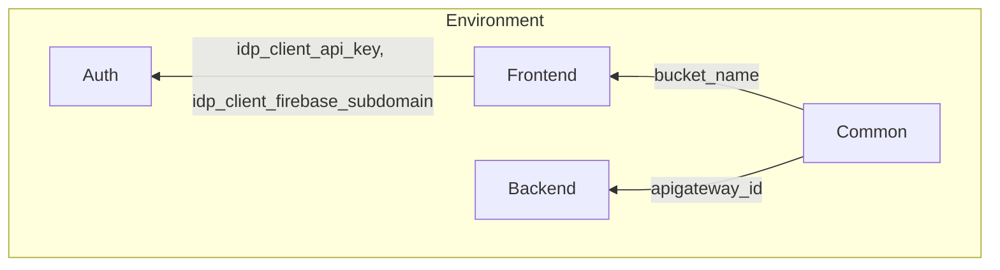

# Deployment Procedure.

This procedure is to be followed when deploying a **new realm** and setting up its **first environment**. **For additional environments**, simply **repeat** [Step 4: Deploy the Environment](#step-4-deploy-the-environment).

All the scripts mentioned in this documentation are expected to be run from the root of the [iac](/iac) directory. But you can run them from anywhere by providing the full path to the script.

_______


## Step 0: Set up the working environment.

### Prerequisites

#### General

- A recent version of [git](https://git-scm.com/) (e.g. ^2.37 )

- [Python 3.8 or higher](https://www.python.org/downloads/)
- [Pulumi CLI](https://www.pulumi.com/docs/install/).
- [Google Cloud SDK (gcloud)](https://cloud.google.com/sdk/docs/install)


#### Building and uploading artifacts

- Backend [requisites](/backend/README.md#prerequisites)
- Frontend [requisites](/frontend-new/README.md#prerequisites)

### Iac Virtual Environment

In the iac directory, run the following commands:

```shell
# create a virtual environment
python3 -m venv venv-iac

# activate the virtual environment
source venv-iac/bin/activate
```

Install the dependencies:

```shell
pip install -r requirements.txt
```

> Note:
> Before running performing any tasks such as building the image or running the code locally, activate the virtual environment so that the installed
> dependencies are available:
>  ```shell
>  # activate the virtual environment
>  source venv-iac/bin/activate
>  ```
> To deactivate the virtual environment, run:
> ```shell
> # deactivate the virtual environment
> deactivate
> ```

_______


## Step 1: Create Realm.

### Step 1.1: Create a GCP Organization and Link the Billing Account.

As said this project is deployed on Google Cloud Platform. To create a new realm, you need to create a new GCP organization and link the billing account to it.
For more information on how to create a new GCP organization, please refer to the [official documentation.](https://cloud.google.com/resource-manager/docs/organization-setup)

At the end of this step, get the following values:

* Organization ID: Unique identifier for the organization (e.g., `abc123`).
* Customer ID: A unique identifier for the customer account (e.g., `customers/abc123`).
* Billing Account ID: Identifier for a billing account associated with the organization.

### Step 1.2: Create a Workspace Custom Role.

The custom role for managing groups must be created in the Google Workspace of the organization where the infrastructure will be deployed.
Create the custom role using the [admin roles console of the workspace](https://admin.google.com/ac/roles) and assign the following permissions: `Create`,
`Delete`, `Read`, and `Update` Groups.

> **Note**: The custom role is needed to avoid using the existing built-in _Groups Admin_ that has too broad permissions.

### Step 1.3: Create a Root Folder.

Create the realm's root folder manually in the [gcloud console](https://console.cloud.google.com/cloud-resource-manager).
All resources will be created under this folder. It is your decision where to create the root folder, it can be at the organization root or in a subfolder of
the organization.

### Step 1.4: Create Google OAuth Project Folders.

In the root folder of the realm, create two folders:
- One for `upper-env` Google OAuth projects.
- One for `lower-env` Google OAuth projects.

You can name them as you prefer, but keep their IDs, as they will be required in later steps.


### Step 1.5: Create a Root Project.

Create the realm's root project manually in the root folder from the previous step using the [gcloud console](https://console.cloud.google.com/cloud-resource-manager):

- Create the GCP project under the [root folder](#step-13-create-a-root-folder).
  - Add a random suffix to make it is unpredictable.
- Enable the following apis manually on this project:
    - `Service Usage API (serviceusage.googleapis.com)`
    - `Compute Engine API (compute.googleapis.com)`. (_Note: To enable this API you must be the administrator of the billing account._)
- Ensure the root project is linked to a billing account.

### Step 1.6: Create an Admin Service Account.

Create a service account that will be used to set up the realm:

- Create the service account in the realm's root project from the previous step using
  the [gcloud console](https://console.cloud.google.com/iam-admin/serviceaccounts).
- Using the [admin roles console](https://admin.google.com/ac/roles) of the Google Workspace, grant this service account the custom role
  created in [`Step 1.2`](#step-12-create-a-workspace-custom-role)
- Using the [IAM console](https://console.cloud.google.com/iam-admin/iam) grant the following roles to the service account:
    - At the **organization level** assign the roles:
        - `Organization Role Administrator (roles/iam.organizationRoleAdmin)`
        - `Billing Account Administrator (roles/billing.admin)`
    - At the **realm's root folder level** assign the roles:
        - `Folder Admin (roles/resourcemanager.folderAdmin)`
        - `Service Usage Admin (roles/serviceusage.serviceUsageAdmin)`
        - `Service Account Admin (roles/iam.serviceAccountAdmin)`
        - `Service Account Key Admin (roles/iam.serviceAccountKeyAdmin)`
        - `Artifact Registry Administrator (roles/artifactregistry.admin)`
        - `Secret Manager Admin (roles/secretmanager.admin)`
        - `Artifact Registry Repository Admin (roles/artifactregistry.repoAdmin)`
    - (Optionally) If the service account is used to tear down resources in any of the environments, at the **realm's root folder level** assign the roles:
        - `Owner (roles/owner)`
        - `Project Deleter (roles/resourcemanager.projectDeleter)`
- Export the service account key to a JSON file and store it securely. This key authenticates with Google Cloud when running Pulumi commands.

### Step 1.7: Set up the Realm Stack.

- Create a new Pulumi stack in the `realm` folder:
  ```shell
  # Use the realm name as the stack name (e.g., "compass")
  pulumi stack init <REALM_NAME>
  ```

- Configure the realm by creating a file named `Pulumi.<REALM_NAME>.yaml` under the `iac/realm` directory with the following content:

```yaml
config:
  gcp:region: "<region>"
  gcp_customer_id: "<customer_id>"  # Organization's customer ID (format: customers/abc123). Use the one from Step 1.1.
  gcp_billing_account_id: "<billing_account_id>"  # Organization's billing account ID. Use the one from Step 1.1.
  gcp_organization_id: "<organization_id>"  # Organization ID. Use the one from Step 1.1
  gcp_root_folder_id: "<root_folder_id>"  # Root folder ID. Use the one from Step 1.3
  gcp_root_project_id: "<root_project_id>"  # Root project ID. Use the one from Step 1.5
  base_domain_name: "<base_domain_name>"  # Base domain (e.g., tabiya.tech). It must be the top level domain.
  gcp_upper_env_google_oauth_projects_folder_id: "<upper_env_google_oauth_projects_folder_id>"  # Folder ID for upper environment google oauth projects. Use the one from Step 1.4.
  gcp_lower_env_google_oauth_projects_folder_id: "<lower_env_google_oauth_projects_folder_id>"  # Folder ID for lower environment google oauth projects. Use the one from Step 1.4.
```

> **ATTENTION**: Do not check the `Pulumi.<REALM_NAME>.yaml` file to the repository, as it contains sensitive information.

- Deploy the realm by running:
    ```shell
      GOOGLE_APPLICATION_CREDENTIALS=<REALM_ADMIN_SA_KEY_PATH> pulumi up -C realm -s <REALM_NAME>
    ```

### Step 1.8: Create and Upload the Stack Config YAML.

1. **Create a YAML file** listing the environments under your realm.
2. **Upload the file** to the root project secret with the name `<environments-config>`.
3. **Use the following format:**
   ```yaml
   environments:
     - environment_name: "<env-name>"  # e.g., dev, test, prod, partner-a-dev
       deployment_type: "<auto | manual>"  # "auto" deploys if deploying multiple environments by environment type while manual happens if deploying a single environment.
       config:
         gcp:region: "<region>"  # GCP region for the environment
         environment_type: "<dev | test | prod>"  # Environment type
   ```  

### Step 1.9: Setup Sentry.

Sentry is for now **set up manually**. Follow these steps:

1. **Create a Sentry Account** under an organization.
2. **Create Two Projects**:
    - **Frontend Project**: Select **React** as the project type.
    - **Backend Project**: Select **FastAPI** as the project type.
3. **Retrieve the DSNs** for both projects.
4. **Store them in the `.env` file**:
    ```dotenv
    # DSN for the frontend Sentry project  
    FRONTEND_SENTRY_DSN=<dsn>
    # DSN for the backend Sentry project
    BACKEND_SENTRY_DSN=<dsn>
    ```

_______


## Step 2: Create a Google OAuth Project.

The Google OAuth enables Google Sign-In and requires a privacy page, a consent screen, and branding configurations, including logos and app name.


### Step 2.1: Create a Google Project.

- **Create a new project** in the [Google Cloud Console](https://console.cloud.google.com/cloud-resource-manager) under the appropriate [OAuth Projects folder created in step 1.4](#step-14-create-google-oauth-project-folders) based on the environment type. 
- Add a random suffix to make it is unpredictable.


### Step 2.2: Set up OAuth Consent Screen.

**Set up the OAuth consent screen** under **API & Services** → **OAuth consent screen** → **Get started**:
- **App Name**: `<app-name>` (e.g., *Compass by Tabiya*)
- **User Support Email**: `<support-email>`
- **Audience**: `External`. Compass is a public application. Not an internal one.
- **Contact Information**: `<developer contact email>`
- Complete the form and submit.

### Step 2.3: Configure Branding.

**Configure Branding**:
- Upload an **App Logo**.
- Add the **authorized domain** (`<base-domain-name>`) from the [Realm stack](#step-17-set-up-the-realm-stack).
- Complete other required fields as outlined in [this support page](https://support.google.com/cloud/answer/13464321).

### Step 2.4: Submit for Verification.

Submit for verification by clicking **Publish App** under the **Audience** tab. This step is optional, but if you don't submit you are limited to 100 users.

### Step 2.5: Configure Data Access.

**Configure Data Access**:
- Add the following scope:
- `.../auth/userinfo.email` – Grants access to users' email addresses in **Identity Platform/Users**.

_______

## Step 3: Upload Artifacts.

We manage three types of artifacts: backend, frontend, and templates. These artifacts are uploaded to the artifact registry in the realm’s root project. Predefined scripts are available to build and upload them.

**Using Service Accounts for Uploads:**

After running pulumi up on the realm stack, the output includes lower and upper service accounts. These accounts are used for:
- Environment deployments
- Uploading artifacts

You can use either the lower or upper service account to upload artifacts, However, the lower service account is recommended for uploading artifacts.

When executing the build and upload scripts, first [authenticate GCP.](#how-to-authenticate-gcp)

### Step 3.1: Build and Upload Backend Artifacts.

Run the **backend artifact build and upload script**:

```shell
./scripts/build-and-upload-be.sh
```  

For more details, use the `--help` flag:


### Step 3.2: Build and Upload Frontend Artifacts.

Run the **frontend artifact build and upload script**:

```shell
./scripts/build-and-upload-fe.sh
```  

For more details, use the `--help` flag:


### Step 3.3: Upload Templates.

Run the **template upload script**:

```shell
./scripts/upload-templates.sh
```  

For more details, use the `--help` flag:

**Note:** These templates are used during environment deployment to ensure that the configurations are compatible with the deployed artifacts.

_______


## Step 4: Deploy the Environment.

### Step 4.1: Create OAuth 2.0 Client.

1. **Create an OAuth 2.0 Client** in the target **OAuth Project** with the following settings:
    - **Application Type**: Web application
    - **Application Name**: Use the format `<realm-name>-<env-name>-web` for easy identification.

2. **Add the Redirect URI**:
   ```  
   https://auth.<env-name>.<realm-name>.<base-domain-name>/__/auth/handler
   ```  
    - This value is calculated in [`environment/__main__.py`](/iac/environment/__main__.py) as the exported `auth_domain`.
    - Ensure it matches the expected domain.

3. **Retrieve the Client Credentials**:
    - After creation, get the **Client ID** and **Client Secret**.
    - Store them in the `.env` file:

    ```dotenv
    # OAuth 2.0 Client ID
    GCP_OAUTH_CLIENT_ID=<client-id>
    # OAuth 2.0 Client Secret
    GCP_OAUTH_CLIENT_SECRET=<client-secret>
    ```

### Step 4.2: Set up the Databases.

This application uses **MongoDB** for data storage.

1. **Application Data**:
    - Set up a **MongoDB cluster** or a **local instance**.
    - Get the **connection string** and choose a **database name**.

    - **Store Credentials in `.env`**:

      Save the connection details in the `.env` file:
        ```dotenv
        # MongoDB connection string  
        APPLICATION_MONGODB_URI=<connection-string>
        # Database name  
        APPLICATION_DATABASE_NAME=<database-name>
        ```
2. **User Data**:
    - Set up a **MongoDB cluster** or a **local instance** for user data.
    - Get the **connection string** and **database name**.
    - **Store Credentials in `.env`**:
      Save the connection details in the `.env` file:
       ```dotenv
       # MongoDB connection string for user data
       USERDATA_MONGODB_URI=<connection-string>
       # Database name for user data 
       USERDATA_DATABASE_NAME=<database-name>
       ```

3. **Taxonomy Data**:
    - Set up a **MongoDB cluster** or **local instance** for taxonomy data.
    - Ensure the database is configured for **vector search queries** ([MongoDB Atlas Vector Search](https://www.mongodb.com/en-us/products/platform/atlas-vector-search)).

    - **Verify the Model ID**:
        - The **Model ID** must exist in one of the **imported models** within the taxonomy database.
        - Refer to the [Generate Embeddings](#step-43-generate-embeddings) section for details.
    - 
    - **Store Credentials in `.env`**:  
      Save the connection details in the `.env` file:
        ```dotenv
        # MongoDB connection string for taxonomy data 
        TAXONOMY_MONGODB_URI=<connection-string>
        # Database name for taxonomy data.
        TAXONOMY_DATABASE_NAME=<database-name>
        # Model ID of an imported model
        TAXONOMY_MODEL_ID=<model-id>
        # The region of the Vertex API to use for embedding and genrative AI models
        VERTEX_API_REGION=<REGION>
        # The name of the embeddings service to use
        # Currently only Google Vertex AI is supported
        EMBEDDINGS_SERVICE_NAME=GOOGLE-VERTEX-AI
        EMBEDDINGS_MODEL_NAME=<EMBEDDINGS_MODEL_NAME>
        ```

4. **Metrics Data**:
    - Set up a **MongoDB cluster** or **local instance** for metrics data.
    - **Store Credentials in `.env`**:  
      Save the connection details in the `.env` file:
        ```dotenv
        # MongoDB connection string for metrics data 
        METRICS_MONGODB_URI=<connection-string>
        # Database name for metrics data
        METRICS_DATABASE_NAME=<database-name>
        ```

### Step 4.3: Generate Embeddings.


To import embeddings, Either copy them from the **source database** (if available) to the **target database**, or **generate new embeddings**. If you've copied the embeddings ensure to run the script one more time with `--indexes-only` flag to index the embeddings.

For details on **generating and importing embeddings**, refer to the [Embeddings README](/backend/README.md#generating-embeddings).

> Note: The name of the embeddings model used to generate the embeddings will later be verified by the application startup to ensure that it is the same that will be used to query the embeddings.

### Step 4.4: Generate Invitation Codes.

Refer to the [Invitation Codes README](/invitations.md) for instructions on importing invitation codes.

If the application is public, you can create global invitation and registration codes and store them in the `.env` file:

```dotenv
FRONTEND_LOGIN_CODE=<login-code>
FRONTEND_REGISTRATION_CODE=<registration-code>
```

> Note: Occasionally monitor their capacity and timeframe and update if needed.

### Step 4.5: Generate Encryption Keys.

Refer to the [Encryption Keys README](/sensitive-data-protection.md#create-an-rsa-privatepublic-key-pair) for instructions on generating RSA encryption keys.

- **Private Key**: Must be kept secure and not shared.
- **Public Key**: Used to encrypt sensitive data.
- Store the Public Key in `.env`:
    ```dotenv
    # Public key for encrypting sensitive data  
    SENSITIVE_PERSONAL_DATA_RSA_ENCRYPTION_KEY=<public-key>
    # Key ID of the public key eg: version-1
    SENSITIVE_PERSONAL_DATA_RSA_ENCRYPTION_KEY_ID=<key-id>
    ```


### Step 4.6: Update the Realm Environment Configurations.

To update the **realm environment configurations**, add the new environment configuration to the **secret** named `<environments-config>` in the **root project** of the realm.

- The **YAML file** created in the [Create a Realm](#step-1-create-realm) section contains the list of environments.
- Add the **new environment configuration** to this file.

Refer to [Step 1.9](#step-18-create-and-upload-the-stack-config-yaml) for the correct format and usage.


### Step 4.7: Construct .env and stack_config.yml.

After completing the previous steps, most required values for the **`.env` file** will be available.

Here are some additional fields.

```dotenv
# Region where the Vertex API is deployed  
VERTEX_API_REGION=<region>
# Enable or disable Sentry for this environment
BACKEND_ENABLE_SENTRY=<True/False>
FRONTEND_ENABLE_SENTRY=<True/False>

# Configure sentry for the environment

# Sentry DSNs (from Step 1.9)
FRONTEND_SENTRY_DSN=<frontend-sentry-dsn>
BACKEND_SENTRY_DSN=<backend-sentry-dsn>

# Optional: Frontend Sentry JSON config
# Fields: tracesSampleRate, replaysSessionSampleRate, replaysOnErrorSampleRate, replayIntegration, enableLogs, levels
FRONTEND_SENTRY_CONFIG='{"tracesSampleRate": 0.2, "replaysSessionSampleRate": 0, "replaysOnErrorSampleRate": 1.0, "replayIntegration": false, "enableLogs": false, "levels": ["error"]}'

# Optional: Backend Sentry JSON config
# Fields: tracesSampleRate, enableLogs, levels
# - enableLogs=false forces event level to ERROR even if levels are broader
# - levels accepted: debug, info, warning, error (maps to event threshold)
BACKEND_SENTRY_CONFIG='{"tracesSampleRate": 0.2, "enableLogs": false, "levels": ["error"]}'

# Enable or Disable Metrics for this environment.
BACKEND_ENABLE_METRICS=<True/False>
FRONTEND_ENABLE_METRICS=<True/False>

# JSON like configurations of the optional features on frontend.
# {
#   "feature_id": {
#     "enabled": <true/false>,
#     "config": {
#       "key": "<value>",
#        ..... other configurations for the feature.
#      }
#    }
# }

FRONTEND_FEATURES='{}'


# JSON like configurations of the available features.
# {
#   "feature_id": {
#     "enabled": <true/false>,
#     "class_path": "<class path to the feature>",
#     "class_name": "<class name of the feature>",
#     "config": {
#       "key": "<value>",
#        ..... other configurations for the feature.
#      }
#    }
# }
BACKEND_FEATURES='{}'

# JSON like Configuration for the experience pipeline
# {
#   "number_of_clusters": 5, 
#   "number_of_top_skills_to_pick_per_cluster": 1
#   ...
# }
BACKEND_EXPERIENCE_PIPELINE_CONFIG='{}'
```  

- **For the final `.env` file structure**, refer to the [env.template](/iac/templates/env.template).
- **For the stack configuration YAML file**, refer to the [stack config template](/iac/templates/stack_config.template.yaml).

These **stack configurations** are used as **Pulumi configurations**.


### Step 4.8: Run the setup.py script.


Once the `.env` file and the **stack config YAML file** are set up, run the [`setup_env.py`](/iac/scripts/setup_env.py) script to **initialize the environment** and **upload configurations**.

**Usage:**

```shell
./scripts/setup_env.py --help
```  

For more details on how the script works, use the `--help` flag.


### Step 4.9: Prepare and Deploy the Environment.

Authenticate to the [GCP](#how-to-authenticate-gcp) And [authenticate AWS](#how-to-authenticate-aws) Before running this script.

Once the `setup_env.py` script is completed, the environment is ready for deployment.

Deployment can be done **automatically** via the GitHub pipeline (on push or release) or **manually** using the following steps:

1. **Prepare the Deployment**
   Run the [`prepare_env.py`](/iac/scripts/prepare.py) script to:  
   - **Download artifacts** and configurations from the realm’s root project.  
   - **Verify deployment configurations** against the uploaded artifacts using templates.

    ```shell
    ./scripts/prepare_env.py --help
    ```

2. **Deploy the Environment**

   Run the [`up.py`](/iac/scripts/up.py) script to:  
   - **Create resources** in the GCP project using `pulumi up`.  
   - **Run smoke tests** to validate deployment success.

    ```shell
    ./scripts/up.py --help
    ```

The deployment is done in the flowing flow.



### Step 4.10: Configure the Auth Domains and Email Templates for the Identity Platform.

The auth domains are configured automatically during the deployment process.

However, to show the  `%APP_NAME%` in the email templates, for example, in the verification email you have to manually enable the consent-/branding-screen in the Google cloud console for the **environment project** and set the app name there. Even if the project uses a different OAuth project, the app name is taken from the environment project's consent screen (seems like a bug in the firebase).

## How to

### How to authenticate GCP.

#### Option 1: Using personal gcloud account (Recommended).

- Login to the gcloud

    ```shell
    gcloud auth login
    ```

- set the application default quota project to the root project. [ref.](https://cloud.google.com/sdk/gcloud/reference/auth/application-default/set-quota-project)
    ```shell
    gcloud config set project <ROOT_PROJECT_ID>
    ```


#### Option 2: Using the `GOOGLE_APPLICATION_CREDENTIALS` environment variable.

You can use the service account key file to authenticate with Google Cloud and run the backend.
This is the most convenient way to run the backend locally, but it is less secure than service account impersonation. It
is recommended to use this method for development purposes.

> ATTENTION: The service account key file should be kept secure and not shared with others.
> It should not be committed to the repository.
>

To authenticate with the service account key file, set the `GOOGLE_APPLICATION_CREDENTIALS` environment variable to the
path of the service account key file and run the backend.


#### Option 3: impersonating a service account (an edge case)

Initially authenticate with your personal Google Cloud account:

 ```shell
 gcloud auth application-default login
 ```

Then, impersonate the service account that has the necessary roles to manage the infrastructure. To impersonate a
service account, run the following command:

 ```shell
 gcloud config set auth/impersonate_service_account <SERVICE_ACCOUNT_EMAIL>
```

> Note:
> When using service account impersonation, your account should be granted access with
> the `roles/iam.serviceAccountTokenCreator` to that service account. Ask the project owner to grant you that role.
>

##### Set the Google Cloud Project

Set the project to use with the Google Cloud SDK:

```shell
gcloud config set project <PROJECT>
```

### How to authenticate AWS.

- For authenticating to the AWS please refer to this [pulumi documentation.](https://www.pulumi.com/registry/packages/aws/installation-configuration/)
