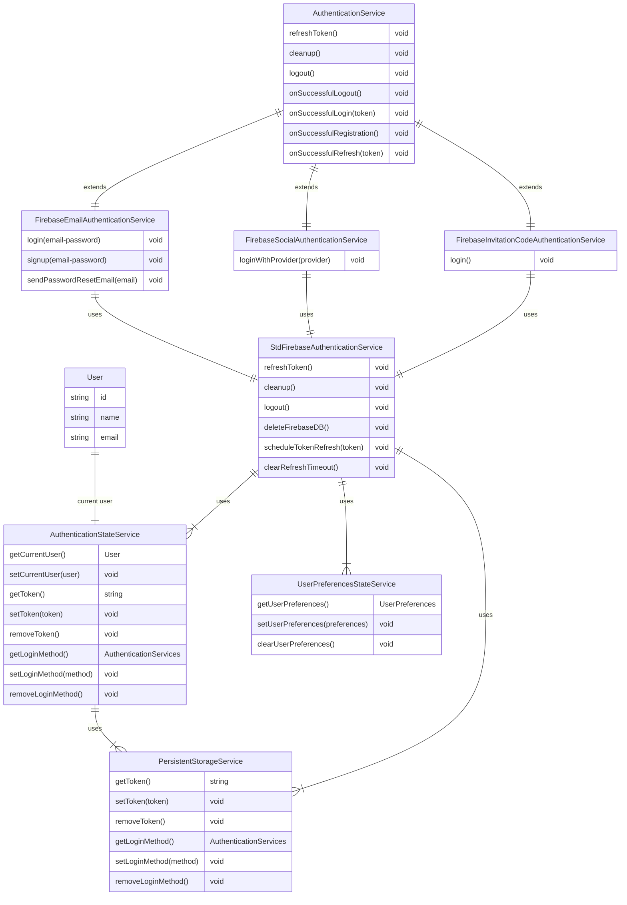
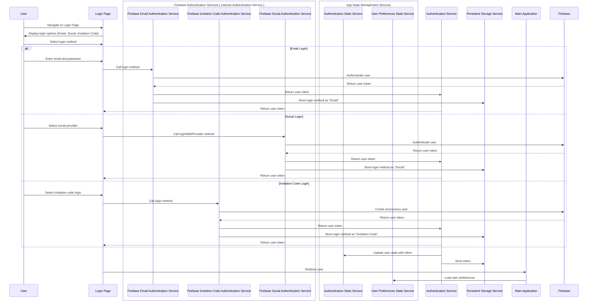
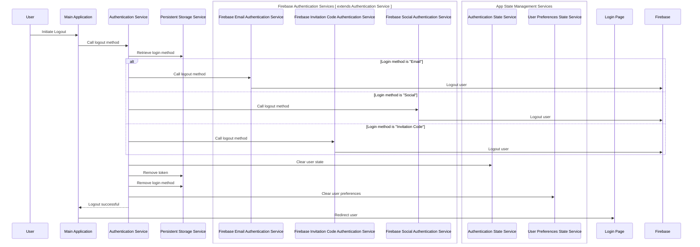

## Authentication Hierarchy Documentation

### Introduction

This document provides an overview of the authentication hierarchy in the frontend application. It includes entity-relationship diagrams and sequence diagrams to illustrate the structure and flow of the authentication system.

### Authentication Services

The authentication system consists of several services that work together to handle user authentication, state management, and persistent storage. The main services are:
- [`AuthenticationService`](src/auth/services/Authentication.service.ts) (abstract class): An abstract base class that defines common methods for authentication services.
- )`: An abstract base class that defines common methods for authentication services.
- [`StdFirebaseAuthenticationService`](src/auth/services/FirebaseAuthenticationService/StdFirebaseAuthenticationService.ts): A utility class that provides a base implementation for Firebase authentication services.
- `FirebaseEmailAuthenticationService`, `FirebaseSocialAuthenticationService`, `FirebaseInvitation CodeAuthenticationService`: Extend the AuthenticationService class and handle specific authentication methods (email/password, social providers, anonymous).
- `AuthenticationStateService`: Manages the current user's authentication state and token.
- `UserPreferencesStateService`: Manages the user's preferences and settings.
- `PersistentStorageUtil`: A utility class for storing and retrieving data from the browser's local storage.
### Entity-Relationship Diagram

>The following entity-relationship diagram illustrates the relationships between the main entities in the authentication system:

    
### Login Flow

>The following sequence diagram illustrates the login flow for different authentication methods (email/password, social providers, anonymous):

### Logout Flow
> The following sequence diagram illustrates the logout flow:

## Key Responsibilities and Boundaries
### StdFirebaseAuthenticationService
- Provides a base implementation for Firebase authentication services
- Handles common authentication tasks such as logging out, refreshing tokens, and managing authentication state
- Manages the Firebase authentication listener and token refresh process
- Does not handle the actual authentication process (login, signup) which is delegated to child classes
- Interacts with Firebase authentication, AuthenticationStateService, and UserPreferencesStateService
### AuthenticationStateService
- Manages the current user's authentication state
- Stores and retrieves the user token and login method using PersistentStorageUtil
- Provides methods to get/set/clear the current user
### UserPreferencesStateService
- Manages the user's preferences and settings
- Provides methods to get/set/clear user preferences
### PersistentStorageService
- A utility class for storing and retrieving data from the browser's local storage
- Provides methods to get/set/remove the user token and login method
- Used by AuthenticationStateService to persist user state