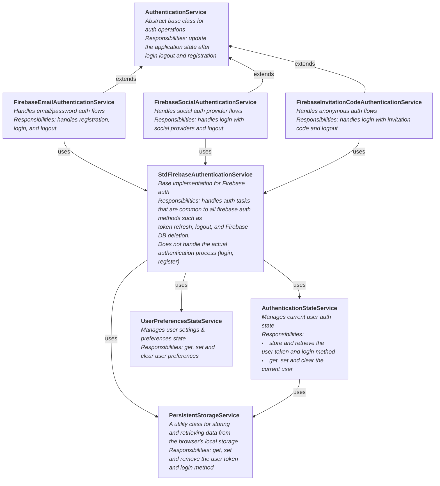
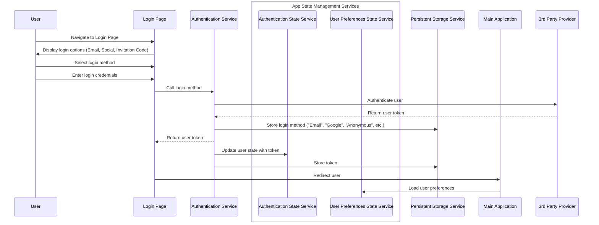
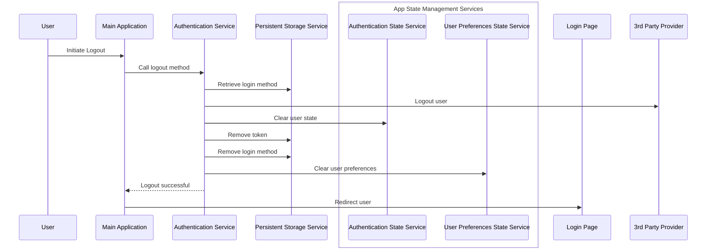

# Authentication Hierarchy Documentation

## Introduction

This document provides an overview of the authentication hierarchy in the frontend application. 

## Authentication Services

The authentication system consists of several services that work together to handle user authentication, state management, and persistent storage. The main
services are:

- [`AuthenticationService`](src/auth/services/Authentication.service.ts) (abstract class): An abstract base class that defines common methods for authentication
  services.
- [`StdFirebaseAuthenticationService`](src/auth/services/FirebaseAuthenticationService/StdFirebaseAuthenticationService.ts): A utility class that provides a
  base implementation for Firebase authentication services.
- [`FirebaseEmailAuthenticationService`, `FirebaseSocialAuthenticationService`,
  `FirebaseInvitationCodeAuthenticationService`](src/auth/services/FirebaseAuthenticationService): Extend the AuthenticationService class and handle specific
  authentication methods (email/password, social providers, anonymous).
- [`AuthenticationStateService`](src/auth/services/AuthenticationState.service.ts): Manages the current user's authentication state and token.
- [`UserPreferencesStateService`](src/userPreferences/UserPreferencesService/userPreferences.service.ts): Manages the user's preferences and settings.
- [`PersistentStorageService`](src/app/PersistentStorageService/PersistentStorageService.ts): A utility class for storing and retrieving data from the browser's
  local storage.

## Login Flow

The following sequence diagram illustrates the login flow for different authentication methods (email/password, social providers, anonymous):

## Logout Flow

The following sequence diagram illustrates the logout flow:

