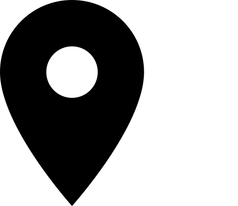

# Skills Report Icons Sources 
The [report-icons-inskscape.svg](report-icons-inskscape.svg) was created using [Inkscape](https://inkscape.org/). It contains the source svg images for the png files used in the skills report and exported to the [src/public](../public) folder. These are:
- [location.png](../public/location.png) 
- [phone.png](../public/phone.png) 
- [email.png](../public/email.png) 
- [employee.png](../public/employee.png)  
- [self-employment.png](../public/self-employment.png) 
- [community-work.png](../public/community-work.png) 

The above report icons are based on icons from the [@mui/icons-material](https://mui.com/material-ui/material-icons/) project.