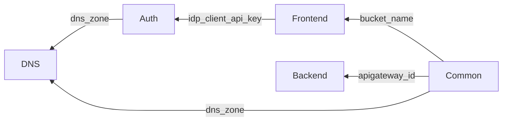

# Infrastructure as Code

The infrastructure for Compass is managed using [Pulumi](https://www.pulumi.com/). The infrastructure is defined in code and can be deployed to Google Cloud
Platform (GCP) using Pulumi.

## IaC Codebase Components

### Keywords

- **realm**: The top-level container of the organization's infrastructure for this project (compass).
- **environment**: A combination between partner and environment. It is a project in the GCP organization that is used to deploy the infrastructure for a specific partner. The name is usually called <realm-name>.<environment-name> eg: `compass.dev`, `compass.partner-a-dev`, `test-realm.dev`

### Components

The IaC is divided into seven subprojects and lib folder for re-usable code/functions/types.

- [realm](realm): Sets up the realm.
- [environment](environment): Sets up the environment project and enable all the required APIs.
- [DNS](dns): Sets up the DNS Zone and AWS name servers for the subdomains. It is used to set up domain delegation for the subdomains.
- [auth](auth): Sets up the authentication infrastructure. (Identity Platform, IDPs, and Firebase).
- [backend](backend): Sets up the backend application's infrastructure. Cloudrun and API Gateway for the backend application.
- [frontend](frontend): Sets up the frontend application's infrastructure, a static website hosted on Google Cloud Storage.
- [common](common): Sets up the common resources for both backend and frontend such as th Load balancer, and the SSL certificate.

## The Realm

The realm is the top-level container of the organization's infrastructure for this project (compass). It has access to the groups, projects, and folders in under the realm.

The main components of the realm are:

* Root Folder. The root folder is the top-level folder in the GCP organization where all the resources of the realm are created.
* Root Project. The root project is at the root folder, it's purpose is to host resources that are common to all projects in the realm.
  * Service Accounts: Service accounts used to run deployments of environments(Project) and setting up the realm.
  * Artifacts Repositories:  Docker and generic repositories for storing images and other artifacts.
  * Environment Configurations Secret: A secret that contains the list of all the environments under the realm.

* Folders for the environments. There are two types of environments, **_lower_** and **_production_** environments. Lower environments are used for development
  and testing, while production environments are used for production.

* organisation groups common role, a role that is common for all groups which are not added by default. 

* User Groups: **_Realm developers_** and **_Realm admins_** groups. These groups are used for granting permissions to the users. (Note: Memberships will be added manually)
    _The roles/permissions will be inherited from the production level to the lower level in the hierarchy. Examples:_
  * a new project (~read `environment`) to the `lower environment` folder.
    * all users in the `compass.developers` group gains `roles/owner` permissions to the new project.
    * all users in the `compass.admins` group gains `roles/owner` permissions to the new project.
  * a new project (~read `environment`) to the `production environment` folder.
    * all users in the `compass.developers` group gains `roles/viewer` permissions to the new project.
    * all users in the `compass.admins` group gains `roles/owner` permissions to the new project.

> _**Note:** Even though the admins are the owner of the realm, 
> We deny delete project permissions on protected projects, This is to prevent accidental project deletion.
> Reason being we don't want in any case to delete projects in the realm because that is where the user credentials are hosted._

Refer to this Image for the visual representation.

## The Environment

The environment is the project in the GCP organization that is used to deploy the infrastructure for a specific partner. The project name follows the pattern "<realm-name>-<environment-name>" eg: `compass-dev`, `compass-partner-a-dev`, `test-realm.dev`.
It is where the application instance is deployed, and the infrastructure is managed. The folder is created in the respective environment folder in the realm.

The main components of the environment are:

* **The project:** The project is the top-level container of the resources in the environment.
  * The DNS Zone. The DNS Zone for the environment, it is used to set up the environment domain(`<env-name>.<realm-name>.<base-domani-name>`) and subdomains.
  * The auth resources: Identity Platform, IDPs, Firebase and subdomain for the auth.
  * The backend resources: Cloud Run for backend image and the API Gateway.
  * The frontend resources: Google Cloud Storage for the static website.
  * The common resources for the backend and frontend: Load balancer, and the SSL certificate.

Refer to the [Components](#components) section for more details on the components.

Refer to this Image for the visual representation of all the components in the environment.

## Scripts

To achieve both manual and automatic deployments with ease on this infrastructure, we have created a set of scripts that can be used to set up, prepare and deploy the infrastructure. 

The scripts are found in the [`scripts`](scripts) folder. The scripts are divided into two categories:

### 1. Build and Upload artifacts

After the source code is changed, we need to build and upload the artifacts. That is the docker image for the backend, and the frontend build output files for the frontend. We have worked on three scripts to automate this process.

- `upload-templates.sh`: The one that uploads two templates for the iac stack_config_template and .env file template.
- `build-and-upload-be.sh`: The one that builds the backend image and uploads it to the GCP Artifact Registry  (docker repository).
- `build-and-upload-fe.sh`: The one that builds the frontend and uploads it to the GCP Artifact Registry (generic repository).

### 2. Set up env.

This script is used to set up a new environment, or update the configurations for the existing environment for a given release.

For more information, please refer to the actual script help.

### 3. Prepare deployment.

This script is used to prepare a given deployment, it downloads all the configurations required for the deployment. It also does some sanity checks like comparing the templates with the actual configurations to ensure that the configurations are up to date with the artifacts.

For more information, please refer to the actual script help.

### 4. Deploy (up).

This script is used to deploy the infrastructure for the environment. It uses pulumi automation API to deploy the infrastructure. It also does smoke tests after the deployment to ensure that the deployment was successful. 

It does so in the following flow.

For more information, please refer to the actual script help.

## Github Pipeline

For automatic deployments, we use Github Actions to deploy the automatic environments. On push to main or push a commit message containing '[pulumi up]', we deploy to all automatic `dev` environments. On a new github release, All automatic test environments are deployed and then, all production automatic environments are deployed. 

For manually deployed environments, we use github workflow dispatch functionality to trigger the deployment. Or you can run the [prepare](#3-prepare-deployment) and [deploy](#4-deploy-up) script to deploy the environment.

Github  pipeline requires some secrets and environments to be set up. The secrets are:

Secrets:

- `GCP_LOWER_ENVS_SERVICE_ACCOUNT_JSON`: The service account json for the service account that has the permissions to deploy lower environments.
- `GCP_PROD_ENVS_SERVICE_ACCOUNT_JSON`: The service account json for the service account that has the permissions to deploy production environments.
- `SENTRY_AUTH_TOKEN`: The auth token for the sentry project. It is used to upload frontend source maps.
- `GCP_REALM_ROOT_PROJECT_ID`: The project id of the root project in the realm.
- `PULUMI_ACCESS_TOKEN`: The pulumi access token for the pulumi account that has the permissions to deploy the infrastructure.
- `AWS_DNS_UPDATE_ACCESS_KEY`: The access key for the AWS account that has the permissions to update the DNS records.
- `AWS_DNS_UPDATE_SECRET_ACCESS_KEY`: The secret access key for the AWS account that has the permissions to update the DNS records.

Variables:

- `REALM_NAME`: The name of the realm.
- `ARTIFACT_REGISTRY_REGION`: The region of the artifact registry. Usually the region where the realm root project is located in unless it is a different region.

### Release Process

Our release process is complex because configurations are versioned in sync with releases.

#### Release Process

**Creating a Release**
  - To initiate a release, create a new GitHub release.
  - Once the release is created, the pipeline will automatically deploy all automatic deployed environments.

**Handling Configuration Changes**
  - If configuration changes are required for a release, we need to ensure that the environment is properly set up before deployment.
  - This is achieved using the [setup environment script](#2-set-up-env).
  - The target Git branch should be the release branch (tag) created.
  - If configurations need to be associated with a specific commit, specify the SHA accordingly.

As a developer, I might want to test new configurations by pushing with a commit message containing `[pulumi up]`. I can use this to test the configurations before merging to main.

## How to set up

To set up the infrastructure, refer to the [deployment checklist](../deployment-checklist.md), and the [deployment procedure](../deployment-procedure.md) for the steps to set up the infrastructure.
