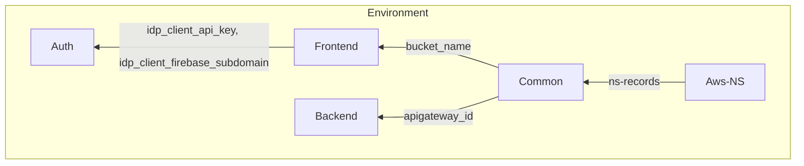

# Infrastructure as Code

The infrastructure for Compass is managed using [Pulumi](https://www.pulumi.com/). The infrastructure is defined in code and can be deployed to Google Cloud
Platform (GCP) using Pulumi.

## Prerequisites

### General

- A recent version of [git](https://git-scm.com/) (e.g. ^2.37 )

- [Python 3.8 or higher](https://www.python.org/downloads/)
- [Pulumi CLI](https://www.pulumi.com/docs/install/).
- [Google Cloud SDK (gcloud)](https://cloud.google.com/sdk/docs/install)


### Building and uploading artifacts

- Backend [requisites](../backend/README.md#prerequisites)
- Frontend [requisites](../frontend-new/README.md#prerequisites)

## Set up working environment

In the iac directory, run the following commands:

```shell
# create a virtual environment
python3 -m venv venv-iac

# activate the virtual environment
source venv-iac/bin/activate
```

Install the dependencies:

```shell
pip install -r requirements.txt
```

> Note:
> Before running performing any tasks such as building the image or running the code locally, activate the virtual environment so that the installed
> dependencies are available:
>  ```shell
>  # activate the virtual environment
>  source venv-iac/bin/activate
>  ```
> To deactivate the virtual environment, run:
> ```shell
> # deactivate the virtual environment
> deactivate
> ```

## IaC Codebase Components

### Keywords

- **realm**: The top-level container of the organization's infrastructure for this project (compass).
- **environment**: A combination between partner and environment. It is a project in the GCP organization that is used to deploy the infrastructure for a specific partner. The name is usually called <realm-name>.<environment-name> eg: `compass.dev`, `compass.partner-a-dev`, `test-realm.dev`


### Components

The IaC is divided into seven subprojects and lib folder for re-usable code/functions/types.

- [realm](realm): Sets up the realm.
- [environment](environment): Sets up the environment project and enable all the required APIs.
- [auth](auth): Sets up the authentication infrastructure. (Identity Platform, IDPs, and Firebase).
- [backend](backend): Sets up the backend application's infrastructure. Cloudrun and API Gateway for the backend application.
- [frontend](frontend): Sets up the frontend application's infrastructure, a static website hosted on Google Cloud Storage.
- [common](common): Sets up the foundational infrastructure such as a load balancer, SSL certificate and DNS records for the entire application.
- [aws-ns](aws-ns): Sets up the AWS name servers for the subdomains. It is used to set up domain delegation for the subdomains.

## The Realm

The realm is the top-level container of the organization's infrastructure for this project (compass). It has access to the groups, projects, and folders in the organization.


The main components of the realm are:
* Root Folder. The root folder is the top-level folder in the GCP organization where all the resources of the realm are created.
* Root Project. The root project is at the root folder, it's purpose is to host resources that are common to all projects in the realm, -
  * Service Accounts: Service accounts used to run deployments of environments(Project).
  * Artifacts Repositories:  Docker and generic repositories for storing images and other artifacts.
  * Environment Configurations Secret: A secret that contains the configuration for the environments.

* Folders for the environments. There are two types of environments, **_lower_** and **_production_** environments. Lower environments are used for development
  and testing, while production environments are used for production.
* organisation groups common role, a role that is common for all groups which are not added by default.
* User Groups: **_Realm developers_** and **_Realm admins_** groups. These groups are used for granting permissions to the users. (Note: Memberships will be added manually)
  <br /><br />_The roles/permissions will be inherited from the production level to the lower level in the hierarchy. Examples:_
  * a new project (~read `environment`) to the `lower environment` folder.
    * all users in the `compass.developers` group gains `roles/owner` permissions to the new project.
    * all users in the `compass.admins` group gains `roles/owner` permissions to the new project.
  * a new project (~read `environment`) to the `production environment` folder.
    * all users in the `compass.developers` group gains `roles/viewer` permissions to the new project.
    * all users in the `compass.admins` group gains `roles/owner` permissions to the new project.

### Create a Realm.

#### Step 1: Organization and Billing Account

To proceed, you need a Google Cloud Platform (GCP) organization with the following details:

* Organization ID: Unique identifier for the organization (e.g., `abc123`).
* Customer ID: A unique identifier for the customer account (e.g., `customers/abc123`).
* Billing Account ID: Identifier for a billing account associated with the organization.

#### Step 2. Workspace custom role for managing groups

The custom role for managing groups must be created in the Google Workspace of the organization where the infrastructure will be deployed.
Create the custom role using the [admin roles console of the workspace](https://admin.google.com/ac/roles) and assign the following permissions: `Create`,
`Delete`, `Read`, and `Update` Groups.

> **Note**: The custom role is needed to avoid using the existing built-in _Groups Admin_ that has too broad permissions.

#### Step 3. Folders

##### 1. Root folder

Create the realm's root folder manually in the [gcloud console](https://console.cloud.google.com/cloud-resource-manager).
All resources will be created bellow this folder. It is your decision where to create the root folder, it can be at the organization root or in a subfolder of
the organization.

##### 2. Identity Project Folders

In the root folder of the realm, create two folders:
- One for `upper-env` identity projects.
- One for `lower-env` identity projects.

You can name them as you prefer, but keep their IDs, as they will be required in later steps.

#### Step 4. Root Project

Create the realm's root project manually in the root folder from the previous step using
the [gcloud console](https://console.cloud.google.com/cloud-resource-manager):

- Create the GCP project.
- Enable the following apis manually:
  - `Service Usage API (serviceusage.googleapis.com)`
  - `Compute Engine API (compute.googleapis.com)`. (_Note: To enable this API you must be the administrator of the billing account._)
- Ensure the root project is linked to a billing account.

#### Step 5. Admin Service Account

Create a service account that will be used to setup the compass realm:

- Create the service account in the realm's root project from the previous step using
  the [gcloud console](https://console.cloud.google.com/iam-admin/serviceaccounts).
- Using the [admin roles console](https://admin.google.com/ac/roles) of the workspace of the realm's root project, grant the service account the custom role
  created in [Step 2](#step-2-workspace-custom-role-for-managing-groups)
- Using the [IAM console](https://console.cloud.google.com/iam-admin/iam) grant the following roles to the service account:
    - At the **organization level** assign the roles:
        - `Organization Role Administrator (roles/iam.organizationRoleAdmin)`
        - `Billing Account Administrator (roles/billing.admin)`
    - At the **realm's root folder level** assign the roles:
        - `Folder Admin (roles/resourcemanager.folderAdmin)`
        - `Service Usage Admin (roles/serviceusage.serviceUsageAdmin)`
        - `Service Account Admin (roles/iam.serviceAccountAdmin)`
        - `Service Account Key Admin (roles/iam.serviceAccountKeyAdmin)`
        - `Artifact Registry Administrator (roles/artifactregistry.admin)`
        - `Secret Manager Admin (roles/secretmanager.admin)`
        - `Artifact Registry Repository Admin (roles/artifactregistry.repoAdmin)`
    - (Optionally) In case the service account is used to tear down resources in any of the environments, at the **realm's root folder level** assign the roles:
        - `Owner (roles/owner)`
        - `Project Deleter (roles/resourcemanager.projectDeleter)`
- Export the service account key to a JSON file and store it securely. This key authenticates with Google Cloud when running Pulumi.
- Activate the service account using the following command:
  ```shell
  gcloud auth activate-service-account --key-file=<REALM_ADMIN_SA_KEY_PATH>
  ```
    Replace `<REALM_ADMIN_SA_KEY_PATH>` with the actual path to your saved key file.


#### Step 6. Pulumi Stack

- Create a new Pulumi stack in the `realm` folder:
  ```shell
  # Use the realm name as the stack name (e.g., "compass")
  pulumi stack init <REALM_NAME>
  ```

- Configure the realm by creating a file named `Pulumi.<REALM_NAME>.yaml` under the `iac/realm` directory with the following content:

```yaml
config:
  gcp:region: "<region>"
  gcp_customer_id: "<customer_id>"  # Organization's customer ID (format: customers/abc123)
  gcp_billing_account_id: "<billing_account_id>"  # Organization's billing account ID
  gcp_organization_id: "<organization_id>"  # Organization ID
  gcp_root_folder_id: "<root_folder_id>"  # Root folder ID
  gcp_root_project_id: "<root_project_id>"  # Root project ID
  base_domain_name: "<base_domain_name>"  # Base domain (e.g., tabiya.tech)
  gcp_upper_env_identity_projects_folder_id: "<upper_env_identity_projects_folder_id>"  # Folder ID for upper environment identity projects
  gcp_lower_env_identity_projects_folder_id: "<lower_env_identity_projects_folder_id>"  # Folder ID for lower environment identity projects
```

> **ATTENTION**: Do not check the `Pulumi.<REALM_NAME>.yaml` file to the repository, as it contains sensitive information.

- Get credentials from the Admin Service Account read the [Step 5](#step-5-admin-service-account) on what is the service account.
- Authenticate with gcloud using the service account credentials.
- Deploy the realm by running:
    ```shell
      GOOGLE_APPLICATION_CREDENTIALS=<REALM_ADMIN_SA_KEY_PATH> pulumi up -C realm -s <REALM_NAME>
    ```

#### Step 7: Environment Configuration

1. **Create a YAML file** listing the environments under your realm.
2. **Upload the file** to the root project secret with the name `<environments-config>`.
3. **Use the following format:**
   ```yaml
   environments:
     - environment_name: "<env-name>"  # e.g., dev, test, prod, partner-a-dev
       deployment_type: "<auto | manual>"  # "auto" deploys if deploying multiple environments by environment type while manual happens if deploying a single environment.
       config:
         gcp:region: "<region>"  # GCP region for the environment
         environment_type: "<dev | test | prod>"  # Environment type
   ```  


## Build and Upload artifacts.

We manage three types of artifacts: backend, frontend, and templates. These artifacts are uploaded to the artifact registry in the realm’s root project. Predefined scripts are available to build and upload them.

Using Service Accounts for Uploads
After running pulumi up on the realm stack, the output includes lower and upper service accounts. These accounts are used for:
- Environment deployments
- Uploading artifacts

You can use either the lower or upper service account to upload artifacts, However, the lower service account is recommended for uploading artifacts.

When executing the build and upload scripts, provide the following arguments:

- **`<ENV_TYPE_GOOGLE_APPLICATION_CREDENTIALS>`** – Path to the service account key file for authentication (use either the lower or upper service account).
- **`<region>`** – The region where the realm was created.
- **`<project_id>`** – The project ID of the realm's root project.
- **`<report_filename>`** – The file where the build and upload report will be appended.
- **`<build_run>`** – The build run number, used for tracking, which build uploaded the artifacts.

### 1. Build and Upload Backend Artifacts

Run the **backend artifact build and upload script**:

```shell
./scripts/build-and-upload-be.sh
```  

For more details, use the `--help` flag:

### 2. Build and Upload Frontend Artifacts

Run the **frontend artifact build and upload script**:

```shell
./scripts/build-and-upload-fe.sh
```  

For more details, use the `--help` flag:

### 3. Upload templates

Run the **template upload script**:

```shell
./scripts/upload-templates.sh
```  

For more details, use the `--help` flag:

**Note:** These templates are used during environment deployment to ensure that the configurations are compatible with the deployed artifacts.


## Google Identity project.

The Identity Project enables Google Sign-In and requires a privacy page, a consent screen, and branding configurations, including logos and app names.

### Setting up Identity Project

1. **Create a new project** in the [Google Cloud Console](https://console.cloud.google.com/cloud-resource-manager) under the appropriate folder based on the environment type.

2. **Set up the OAuth consent screen** under **API & Services** → **OAuth consent screen** → **Get started**:
    - **App Name**: `<app-name>` (e.g., *Compass by Tabiya*)
    - **User Support Email**: `<support-email>`
    - **Audience**: `External`. Compass is a public application. Not an internal one.
    - **Contact Information**: `<developer contact email>`
    - Complete the form and submit.

3. **Configure Branding**:
    - Upload an **App Logo**.
    - Add the **authorized domain** (`<base-domain-name>`) from the [realm configuration](#step-6-pulumi-stack).
    - Complete other required fields as outlined in [this support page](https://support.google.com/cloud/answer/13464321).
    - Submit for verification by clicking **Publish App** under the **Audience** tab.

4. **Configure Data Access**:
    - Add the following scope:
        - `.../auth/userinfo.email` – Grants access to users' email addresses in **Identity Platform/Users**.

## Environment (Deployment)

An **environment** is a combination of a **partner** and an **environment type**. It represents a **GCP project** within the organization that hosts the infrastructure for a specific deployment.

### Setting Up an Environment

We use the Python script [`setup_env.py`](/scripts/setup_env.py) to automate environment setup. However, some manual steps must be completed beforehand to gather required values for the environment configuration file.

#### 1. OAuth 2.0 Client

1. **Create an OAuth 2.0 Client** in the target **Identity Project** with the following settings:
    - **Application Type**: Web application
    - **Application Name**: Use the format `<realm-name>-<env-name>-web` for easy identification.

2. **Add the Redirect URI**:
   ```  
   https://auth.<env-name>.<realm-name>.<base-domain-name>/__/auth/handler  
   ```  
    - This value is calculated in [`environment/__main__.py`](environment/__main__.py) as the exported `auth_domain`.
    - Ensure it matches the expected domain.

3. **Retrieve the Client Credentials**:
    - After creation, get the **Client ID** and **Client Secret**.
    - Store them in the `.env` file:

    ```dotenv
    # OAuth 2.0 Client ID
    GCP_OAUTH_CLIENT_ID=<client-id>
    # OAuth 2.0 Client Secret
    GCP_OAUTH_CLIENT_SECRET=<client-secret>
    ```

#### 2. Databases

This application uses **MongoDB** for data storage.

1. **Application Data**:
    - Set up a **MongoDB cluster** or a **local instance**.
    - Get the **connection string** and choose a **database name**.

    - **Store Credentials in `.env`**:

        Save the connection details in the `.env` file:
        ```dotenv
        # MongoDB connection string  
        APPLICATION_MONGODB_URI=<connection-string>
        # Database name  
        APPLICATION_DATABASE_NAME=<database-name>
        ```
2. **User Data**:
    - Set up a **MongoDB cluster** or a **local instance** for user data.
    - Get the **connection string** and **database name**.
    - **Store Credentials in `.env`**:
       Save the connection details in the `.env` file:
       ```dotenv
       # MongoDB connection string for user data
       USERDATA_MONGODB_URI=<connection-string>
       # Database name for user data 
       USERDATA_DATABASE_NAME=<database-name>
       ```

3. **Taxonomy Data**:
    - Set up a **MongoDB cluster** or **local instance** for taxonomy data.
    - Ensure the database is configured for **vector search queries** ([MongoDB Atlas Vector Search](https://www.mongodb.com/en-us/products/platform/atlas-vector-search)).

    - **Verify the Model ID**:
       - The **Model ID** must exist in one of the **imported models** within the taxonomy database.
       - Refer to the [Importing the Taxonomy Data](#3-embeddings) section for details.

    - **Store Credentials in `.env`**:  
      Save the connection details in the `.env` file:
        ```dotenv
        # MongoDB connection string for taxonomy data 
        TAXONOMY_MONGODB_URI=<connection-string>
        # Database name for taxonomy data
        TAXONOMY_DATABASE_NAME=<database-name>
        # Model ID of an imported model
        TAXONOMY_MODEL_ID=<model-id>
        ```

#### 3. Embeddings

To import embeddings, Either copy them from the **source database** (if available) to the **target database**, or **generate new embeddings**. If you've copied the embeddings ensure to run the script one more time with `--indexes-only` flag to index the embeddings.

For details on **generating and importing embeddings**, refer to the [Embeddings README](../backend/README.md#generating-embeddings).

#### 4. Invitation Codes

Refer to the [Invitation Codes README](../invitations.md) for instructions on importing invitation codes.

#### 5. Encryption Keys

Refer to the [Encryption Keys README](../sensitive-data-protection.md#create-an-rsa-privatepublic-key) for instructions on generating RSA encryption keys.

- **Private Key**: Must be kept secure and not shared.
- **Public Key**: Used to encrypt sensitive data.
- Store the Public Key in `.env`:
    ```dotenv
    # Public key for encrypting sensitive data  
    SENSITIVE_PERSONAL_DATA_RSA_ENCRYPTION_KEY=<public-key>
    # Key ID of the public key eg: version-1
    SENSITIVE_PERSONAL_DATA_RSA_ENCRYPTION_KEY_ID=<key-id>
    ```

#### 6. Update the realm environment configurations.

To update the **realm environment configurations**, add the new environment configuration to the **secret** named `<environments-config>` in the **root project** of the realm.

- The **YAML file** created in the [Create a Realm](#create-a-realm) section contains the list of environments.
- Add the **new environment configuration** to this file.

Refer to [Create Stack Configuration](#step-7-environment-configuration) for the correct format and usage.

#### 7. Setup sentry.

Sentry is currently **set up manually**. Follow these steps:

1. **Create a Sentry Account** under an organization.
2. **Create Two Projects**:
    - **Frontend Project**: Select **React** as the project type.
    - **Backend Project**: Select **FastAPI** as the project type.
3. **Retrieve the DSNs** for both projects.
4. **Store them in the `.env` file**:
    ```dotenv
    # DSN for the frontend Sentry project  
    SENTRY_FRONTEND_DSN=<dsn>
    # DSN for the backend Sentry project
    SENTRY_BACKEND_DSN=<dsn>
    ```

#### 8. Construct .env and stack config yaml

After completing the previous steps, most required values for the **`.env` file** will be available.

Here are some additional fields.

```dotenv
# Region where the Vertex API is deployed  
VERTEX_API_REGION=<region>
# Enable or disable Sentry for this environment
ENABLE_SENTRY=<True/False>
```  

- **For the final `.env` file structure**, refer to the [env.template](/templates/env.template).
- **For the stack configuration YAML file**, refer to the [stack config template](/templates/stack_config.template.yml).

These **stack configurations** are used as **Pulumi configurations**.

#### 9. Run set up env script.

Once the `.env` file and the **stack config YAML file** are set up, run the [`setup_env.py`](scripts/setup_env.py) script to **initialize the environment** and **upload configurations**.

**Usage:**

```shell
GOOGLE_APPLICATION_CREDENTIALS=<ENV_TYPE_GOOGLE_APPLICATION_CREDENTIALS> ./scripts/setup_env.py --help
```  

For more details on how the script works, use the `--help` flag.


#### 10. Prepare and Deploy the environment.

Once the `setup_env.py` script is completed, the environment is ready for deployment.

Deployment can be done **automatically** via the GitHub pipeline (on push or release) or **manually** using the following steps:

1. **Prepare the Deployment**
    Run the [`prepare_env.py`](scripts/prepare.py) script to:  
    ✅ **Download artifacts** and configurations from the realm’s root project.  
    ✅ **Verify deployment configurations** against the uploaded artifacts using templates.
    
    ```shell
    GOOGLE_APPLICATION_CREDENTIALS=<ENV_TYPE_GOOGLE_APPLICATION_CREDENTIALS> ./scripts/prepare_env.py --help
    ```

2. **Deploy the Environment**

    Run the [`up.py`](scripts/up.py) script to:  
    ✅ **Create resources** in the GCP project using `pulumi up`.  
    ✅ **Run smoke tests** to validate deployment success.
    
    ```shell
    GOOGLE_APPLICATION_CREDENTIALS=<ENV_TYPE_GOOGLE_APPLICATION_CREDENTIALS> ./scripts/up.py --help
    ```


The deployment is done in the flowing flow.


```mermaid
flowchart
    subgraph Environment
        direction RL
        Frontend --idp_client_api_key, \n idp_client_firebase_subdomain--> Auth
        Common --apigateway_id--> Backend
        Common --bucket_name--> Frontend
        Aws-NS --ns-records--> Common
    end

```

#### **11. Post Deploy Actions**

Since **SSL and DNS provisioning** takes time, some **manual steps** are required after the initial setup:

1. **Re-run** the `up.py` script to ensure:  
    - DNS records are correctly configured.  
    - Smoke tests pass successfully.
    ```shell
    GOOGLE_APPLICATION_CREDENTIALS=<ENV_TYPE_GOOGLE_APPLICATION_CREDENTIALS> ./scripts/up.py
    ```

2. **Manually Finish setting up the Firebase domain:**
   - Go to the Firebase project.
   - Click the **"Needs Setup"** button to finalize domain configuration.

3. **Configure Firebase Emails Domains:**
