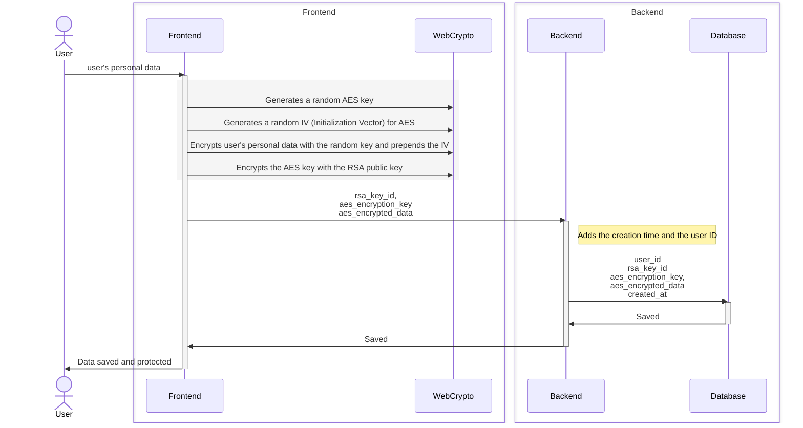
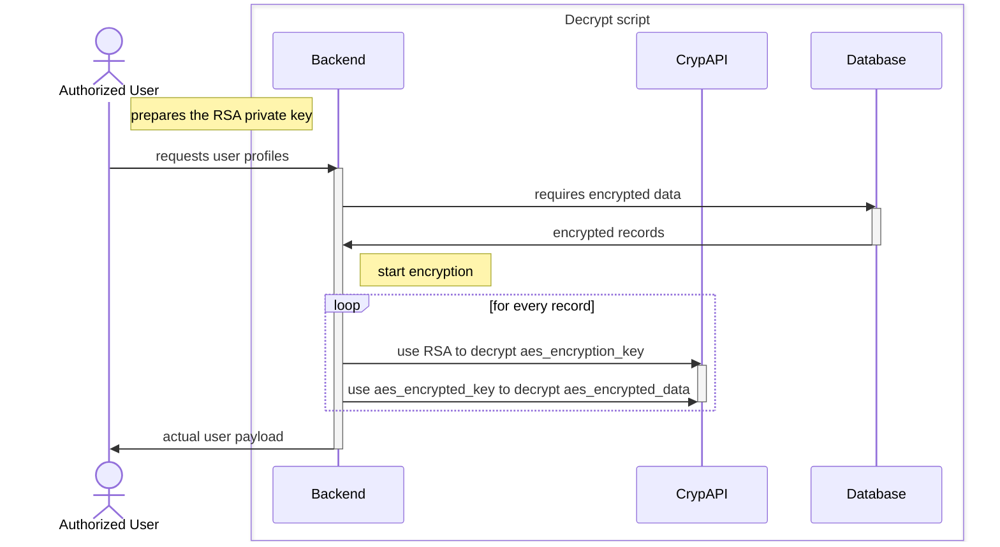

# Sensitive Data Protection

The application stores sensitive personal data, and we have implemented robust measures to protect it. This document outlines how the data is encrypted, the encryption methods used, and the steps to decrypt it when necessary.

## How to set up

After cloning the repository, you need to set up the frontend and backend to encrypt and decrypt the data:

### Create an RSA private/public key pair

Generate a certificate using OpenSSL

```bash
# Generate a private key with 2048 bits (the recommended minimum).
# You are going to be prompted to provide a password.
# Remember: It has a minimum of 4 characters.
openssl genrsa -aes256 -out private-key.pem 2048

# generate a public key from the private key
openssl rsa -in private-key.pem -pubout -out public-key.pem
```

>NOTE:
> You can use alternative methods like `ssh-keygen` or `GnuPG` to generate the keys, among others.

### Set Up the Frontend for Encryption

The public key created in the previous step  must be added to the frontend. 

Refer to the [frontend documentation](frontend-new/README.md#installation) for more information.

### Decrypting Sensitive Personal Data

The script [`decrypt_sensitive_personal_data.py`](backend/scripts/sensitive_data/decrypt_sensitive_personal_data.py) is used to decrypt sensitive user data from a MongoDB database.

#### Prerequisites:

The script requires the following environment variables to be set:

```dotenv
# The URI of the MongoDB instance containing the encrypted user data
DECRYPT_SCRIPT_USERDATA_MONGODB_URI=<MONGODB_URI>

# The name of the database where the user data is stored
DECRYPT_SCRIPT_USERDATA_DB_NAME=<USERDATA_DATABASE_NAME>
```

In addition to the environment variables, you will need:

- A private key file (in PEM format).
- The password used to generate the private key.
- An output location to save the decrypted data.

#### Usage

To view detailed usage instructions, run the script with the `-h` flag:

```bash
python3 decrypt_sensitive_personal_data.py -h
```

Ensure all required dependencies and environment variables are properly configured before executing the script.


## Implementation Considerations and Design Decisions

### Requirements

We wanted to:
1. Ensure that user data is protected from:
   - third-party actors
   - unauthorized access even within the organization
   - accidental leaks
2. Encrypt large payloads of user data.
3. Efficiently encrypt and decrypt data, even with a large number of users (hundreds of thousands).

### Solution

We use hybrid RSA and AES encryption:
- **AES**: Fast and suitable for encrypting large amounts of data.
- **RSA**: Used to encrypt the AES key, as it is efficient for small data.

Here is a **high-level** outline of the process:

- **Frontend**: Encrypts user data with AES and encrypts the AES key with the RSA public key.
- **Backend**: Retrieves and stores the encrypted data in the database.
- **Decryption Script**: Reads the data from the database and decrypts it by first decrypting the AES key using the RSA private key, and then decrypting the user data using the AES key.


#### Encryption Design Decisions AES
For AES, the following decisions were made:
- **Key Length**: 256 bits.
- **Mode**: GCM (Galois/Counter Mode); see [NIST SP 800-38D](https://nvlpubs.nist.gov/nistpubs/Legacy/SP/nistspecialpublication800-38d.pdf).
- **Initialization Vector (IV)**: 96 bits Randomly generated using the WebCrypto API to ensure enough randomness as suggested in Section 8.2 IV Constructions of the [NIST SP 800-38D](https://nvlpubs.nist.gov/nistpubs/Legacy/SP/nistspecialpublication800-38d.pdf).
- **Tag Length**: 128 bits as it is the maximum length for GCM. The authentication tag ensures data integrity (does not protect against key guessing).
- By using completely random keys and IVs, the probability of using the same IV abd key twice is **2^(-256) × 2^(-96) = 1/2^352**, much lower than the recommendation in Section 8 "Uniqueness Requirement on IVs and Keys" of [NIST SP 800-38D](https://nvlpubs.nist.gov/nistpubs/Legacy/SP/nistspecialpublication800-38d.pdf).

#### Encryption Recommendations for RSA
As RSA encryption is based on a public-private key pair generated by the system's operator, the following recommendations were made:
- **Key Length**: 2048 bits.
- **Padding**: OAEP (Optimal Asymmetric Encryption Padding) as it is the most secure padding scheme for RSA encryption.
- **Hash Function**: SHA-256 as it is the most secure hash function for OAEP padding.
- **Public Key**: Used to encrypt the AES key.
- **Private Key**: Used to decrypt the AES key.
- **Password**: The private key is password-protected to prevent unauthorized access.

### Sequence Diagrams

1. **Data Encryption**



1. **Data Decryption**



### Common Attack Scenarios and Protections

The following table outlines common attack scenarios addressed by the current implementation. It's important to note that additional measures should be implemented in the deployed system, 
including database and backend systems Role-Based Access Control (RBAC), API protection with end-user authentication, and data encryption in transit and at rest among others.


| #  | Attack                              | Description/How                                                                                                              | Measures Taken                                                                                                                                                                                                                                      |
|----|-------------------------------------|------------------------------------------------------------------------------------------------------------------------------|------------------------------------------------------------------------------------------------------------------------------------------------------------------------------------------------------------------------------------------------------|
| 1  | Man-in-the-Middle Attack            | An attacker may intercept communication between Cloud Run and our database, by gaining infrastructure access. | Data is encrypted on the user's device before transmission, ensuring that it remains unreadable during its journey to the database. Additionally, communication between the client and server is encrypted using TLS.|
| 2  | Database Compromise / Data Leak     | Unauthorized access to database documents or data.                                                                           | Personal data is stored in the database in an encrypted format. Even if the data is exposed, AES-256 encryption ensures that exposed data remains unreadable.                                                                                                     |
| 3  | Brute Force Attack on AES Keys      | Attackers may attempt to crack AES encryption keys to access data.                                                           | We use the AES-256 algorithm, which is highly resistant to brute force attacks. Additionally, each record has a unique key, reducing the attack success rate.                                                                     |
| 4  | Dictionary Attack                   | Attackers may attempt to guess AES keys using dictionary attacks.                                                            | We use randomly generated 256-bit AES keys with high entropy additionaly IV is randomly generated per encryption cycle.            |
| 5  | Unintended Data Logging             | Data may be unintentionally logged due to bugs or missed during reviews.                                                     | Since data is already encrypted on the user's device before transmission, any logged data will remain encrypted and unreadable.                                                                                                                   |
| 6  | Private Key Leak                    | An authorized person may accidentally leak the private key.                                                                  | The private RSA key is protected by an additional password. Even if leaked, another password is required to decrypt the data.                                                                                                                      |
