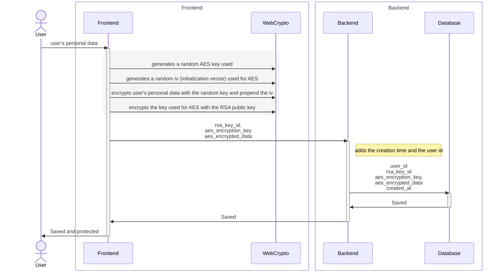
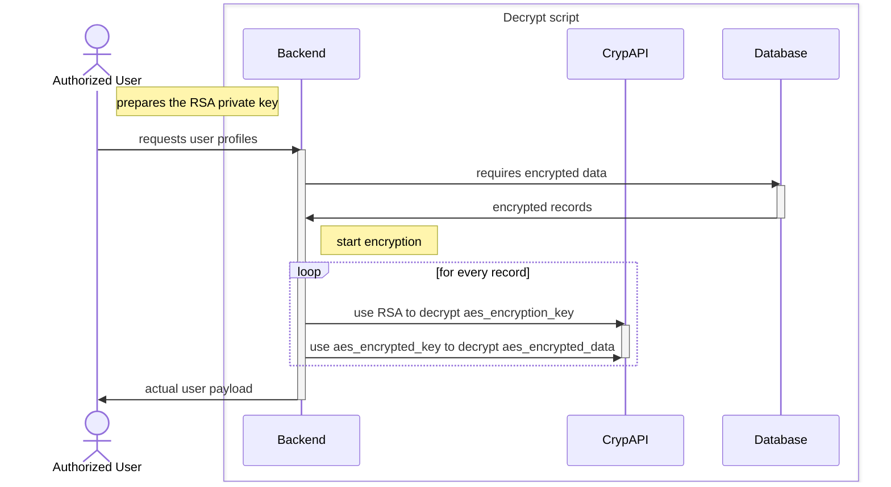

# Sensitive Data Protection.

This application stores sensitive personal data, and we have implemented robust measures to protect it. This document outlines how the data is encrypted, the encryption methods used, and the steps to decrypt it when necessary.


## How to set up.

After cloning the repository, you need to set up the frontend, and the backend to encrypt and decrypt the data:

### Create an RSA private/public key

Generate a certificate using openssl

```bash
# generate a private key with the 2048 bits (the recommended minimum)
# you are going to be prompted to provide a password
# Remember: it has a minimum of 4 characters
openssl genrsa -aes256 -out private-key.pem 2048

# generate a public key from the private key
openssl rsa -in private-key.pem -pubout -out public-key.pem
```

>NOTE:
> You can use alternative methods like `ssh-kegen` or `GnuPG` to generate the keys, among others._

### Set up the frontend for encryption

The public key created in the previous step  must be added to the frontend. 

Refer to this [frontend documentation](frontend-new/README.md#installation) for more information.

### Decrypt Sensitive Personal Data

The script [`decrypt_sensitive_personal_data.py`](backend/scripts/sensitive_data/decrypt_sensitive_personal_data.py) is used to decrypt sensitive user data from a MongoDB database.

#### Prerequisites

The script requires the following environment variables to be set:

```dotenv
# The URI of the MongoDB instance containing the encrypted user data
DECRYPT_SCRIPT_USERDATA_MONGODB_URI=<MONGODB_URI>

# The name of the database where the user data is stored
DECRYPT_SCRIPT_USERDATA_DB_NAME=<USERDATA_DATABASE_NAME>
```

In addition to the environment variables, you will need:

- A private key file (in PEM format).
- The password used to generate the private key.
- Output location to save the decrypted data.

#### Usage

To view detailed usage instructions, run the script with the `-h` flag:

```bash
python3 decrypt_sensitive_personal_data.py -h
```

Ensure all required dependencies and environment variables are properly configured before executing the script.


## Implementation

### Requirements

We needed to:
1. Ensure data is protected from the user's device.
2. Safeguard database data even if compromised.
3. Support encryption for data of any length.
4. Achieve the maximum speed possible for encryption and decryption.

### Solution

We combined RSA and AES:
- **AES**: Fast and suitable for encrypting large data.
- **RSA**: Used to encrypt the AES key due to its efficiency with small data.

### Design

1. **Frontend**: Encrypts user data with AES and encrypts the AES key with RSA.
2. **Backend**: transfers the encrypted data, and the RSA key ID.
3. **Database**: Stores the encrypted data, the RSA key ID, and the creation time.
4. **Decrypt Script**: Decrypts the data using the RSA private key.

#### Encryption Design Decisions AES
For the AES the following decisions were made:
- **Key Length**: 256 bits.
- **Mode**: GCM (Galois/Counter Mode) see [NIST SP 800-38D](https://nvlpubs.nist.gov/nistpubs/Legacy/SP/nistspecialpublication800-38d.pdf).
- **Initialization Vector (IV)**: 96 bits Randomly generated using the WebCrypto API to ensure enough randomness as suggested in Section 8.2 IV Constructions of the [NIST SP 800-38D](https://nvlpubs.nist.gov/nistpubs/Legacy/SP/nistspecialpublication800-38d.pdf).
- **Tag Length**: 128 bits as it is the maximum length for GCM.
- By using completely random keys and IVs, the probability of using the same iv, key twice is 1/2^352, much less than the recommended by Section 8 "Uniqueness Requirement on IVs and Keys" of the  [NIST SP 800-38D](https://nvlpubs.nist.gov/nistpubs/Legacy/SP/nistspecialpublication800-38d.pdf).

#### Encryption Recommendations for RSA
As the RSA encryption is based on a public private key pair generated by the system's operator, the following recommendations were made:
- **Key Length**: 2048 bits.
- **Padding**: OAEP (Optimal Asymmetric Encryption Padding) as it is the most secure padding scheme for RSA encryption.
- **Hash Function**: SHA-256 as it is the most secure hash function for OAEP padding.
- **Public Key**: Used to encrypt the AES key.
- **Private Key**: Used to decrypt the AES key.
- **Password**: The private key is password protected to prevent unauthorized access.

### Sequence Diagrams

1. **Data Encryption**



1. **Data Decryption**



### Common Attack Scenarios and Protections


|   | Attack                              | Description/How                                                                                                                             | Measures taken                                                                                                                                                                                                                                                              |
|---|-------------------------------------|---------------------------------------------------------------------------------------------------------------------------------------------|-----------------------------------------------------------------------------------------------------------------------------------------------------------------------------------------------------------------------------------------------------------------------------|
| 1 | Man-in-the-Middle Attack            | Someone may get in between cloudrun and our database, <br/>either through logs or through getting access to the infrastructure from outside | Data is encrypted on the user's device so in it's journey to the database, it is encrypted and no one can read them                                                                                                                                                         |
| 2 | Database compromise/ Data leak      | Database's documents or data may be accessed outside                                                                                        | Personal data is saved in the database while encrypted, if data is outside no one can read them without the RSA Private key                                                                                                                                                 |
| 3 | Brute Force Attack against AES keys | People my try to crack the AES encryption keys so that they can access data                                                                 | We are using AES-256 algorithm to generate a key which is very complicated for brute force attack <br/>We are also using each key for each record, meaning it would be very complicated to get all the data decrypted                                                       |
| 4 | Dictionary Attack                   | People may try to crack the AES keys using dictionary attacks                                                                               | We are using random strings with 256 bits length AES keys with an Authentication tag, so we are sure that it will almost to impossible to guess our keys even if you guessed the key you would have to guess also the initialization vector same for the authentication tag |
| 5 | Mistakenly Logged Data              | For some reasons, it may be logged as bug or missed during the review                                                                       | Data comes from users' device already encrypted, so in it's journey to our database, it will already be encrypted.                                                                                                                                                          |
| 6 | Private key gets leaked             | From one of the authorized people, they may leak accidentally the private key                                                               | Our private key will require a password so that once leaked, another password will be required to get the actual users details                                                                                                                                              |

